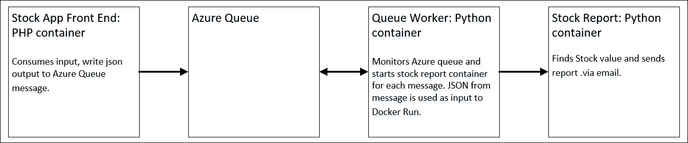

# Stock App - Container Demo

This is simple stock report application; the work flow is:
- User enters a stock symbol or multiple stock symbols and an email address.
- User receives a simple stock report via email.

The purpose of this application is to demonstrate the benefits of container technology at scale. Many current demo applications in circulation demo a static site – database solution. The goal with this demo is to show off how containers enable the future generation of distributed application architecture. 

## Architecture

## Prerequisites

- Azure Storage Queue
- Gmail account configured to allow SMTP access (link).

## Configuration 

Gather the following Items:

- Azure Storage Account Name
- Azure Queue Connection String (see this article)
- Azure Queue Name
- Azure Queue Key
- Docker Host IP Address
- Stock Report Image Name
- Gmail Account Name
- Gmail Password

